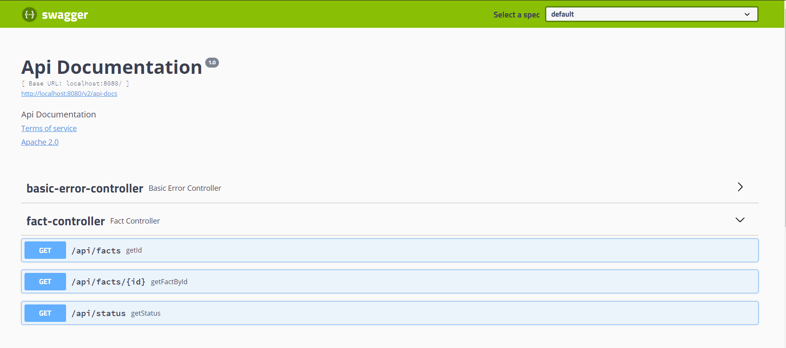

# Andres Lopez

# Yapili / Coding Challenge - Facts API - v1

### Technologies I have used for this Project:
- Java8
- Maven
- SpringBoot 2.2.5
- WebFlux
- Swagger
- OAuth2 - Github
- Yandex API 

### Description:
This project consumes the randomuselessfactApi and gathers 1000 facts to use them to create our own Api. 
Also, you can translate these facts thanks to other languages but you will need a Yandex Api key.
To get the Yandex Api Key, please go to this website and get one: 
[Yandex Api Key](https://translate.yandex.com/developers)

### Dependencies:
To install the dependencies, just go to your pom.xml and add the following dependencies.

```xml
<dependencies>
		<dependency>
			<groupId>org.springframework.boot</groupId>
			<artifactId>spring-boot-starter-web</artifactId>
		</dependency>
		<dependency>
			<groupId>org.springframework.boot</groupId>
			<artifactId>spring-boot-starter-test</artifactId>
			<scope>test</scope>
			<exclusions>
				<exclusion>
					<groupId>org.junit.vintage</groupId>
					<artifactId>junit-vintage-engine</artifactId>
				</exclusion>
			</exclusions>
		</dependency>
		<!--this allows the use of webclient -->
		<dependency>
			<groupId>org.springframework.boot</groupId>
			<artifactId>spring-boot-starter-webflux</artifactId>
		</dependency>
		<dependency>
			<groupId>org.apache.commons</groupId>
			<artifactId>commons-lang3</artifactId>
			<version>3.9</version>
		</dependency>
		<dependency>
			<groupId>org.springframework.boot</groupId>
			<artifactId>spring-boot-starter-oauth2-client</artifactId>
		</dependency>
		<!-- https://mvnrepository.com/artifact/io.springfox/springfox-swagger2 -->
		<dependency>
			<groupId>io.springfox</groupId>
			<artifactId>springfox-swagger2</artifactId>
			<version>2.9.2</version>
		</dependency>
		<!-- https://mvnrepository.com/artifact/io.springfox/springfox-swagger-ui -->
		<dependency>
			<groupId>io.springfox</groupId>
			<artifactId>springfox-swagger-ui</artifactId>
			<version>2.9.2</version>
		</dependency>
	</dependencies>
  ```
  ## API Documentation: 
  - In order to access the Swagger UI, the path is the following: /swagger-ui.html
  - For the json version the path is: /v2/api-docs
  
  ## Enpoints available:
  
  
